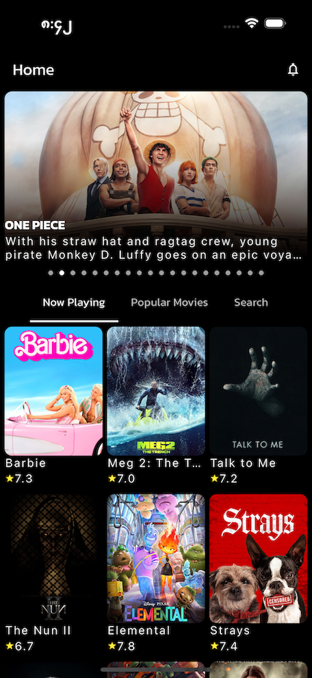
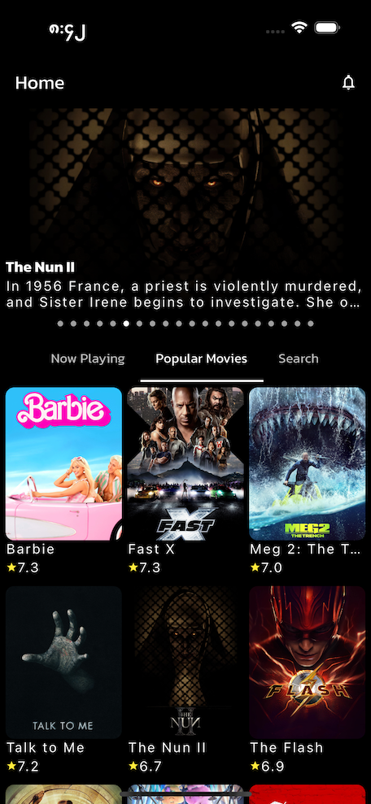
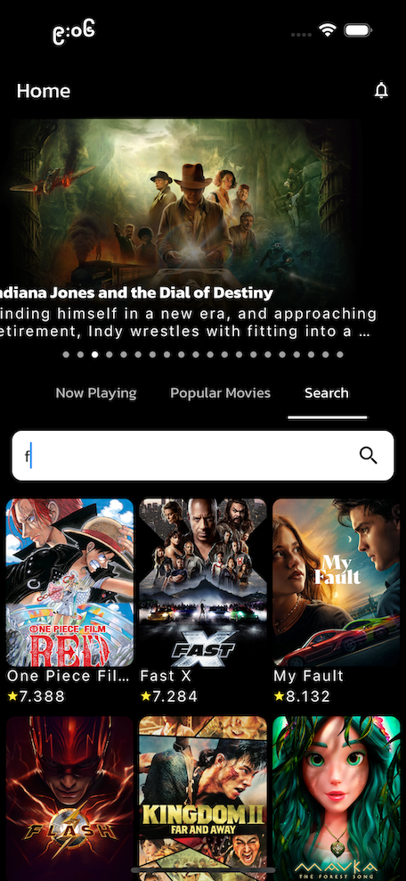
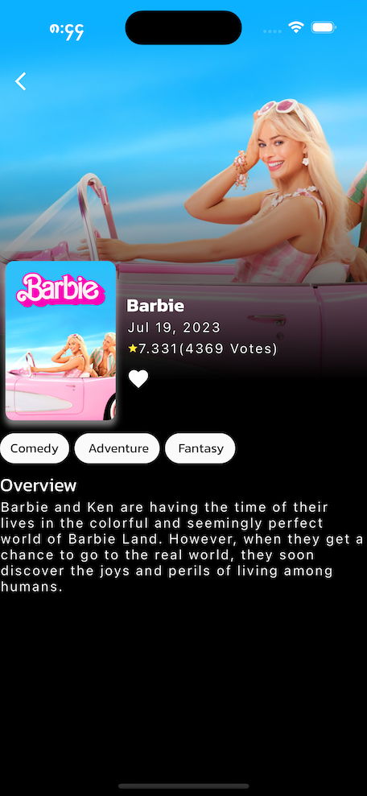

# Movie Demo
Flutter Version : 3.10.6    
 <a href="[https://github.com/Murad9288](https://drive.google.com/file/d/1Um32ZJtdssnVqN6H98mWVWSUw7gMPLl0/view?usp=sharing)" target="_blank"> MovieDemo APK </a>  

API :  themoviedb 
1.NowPlaying Movie Screen 
  

2.Popular Movie Screen 
  

3 Movie Search Screen 
  

4.Movie Details Screen 
  
